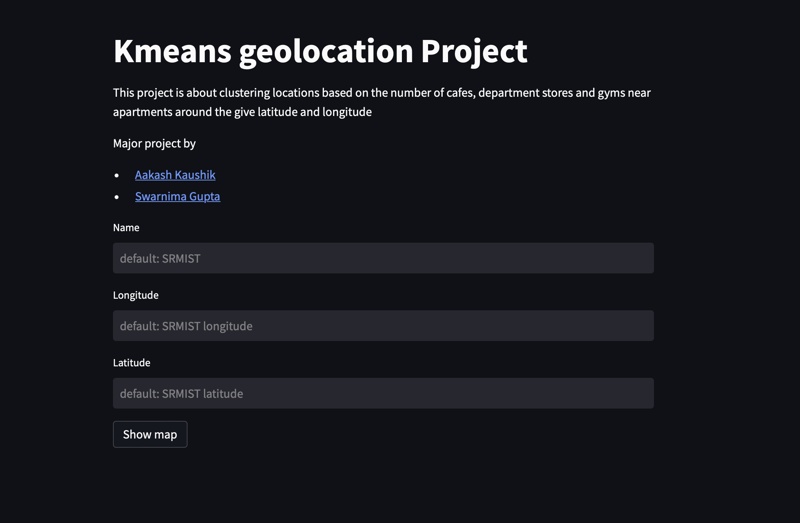
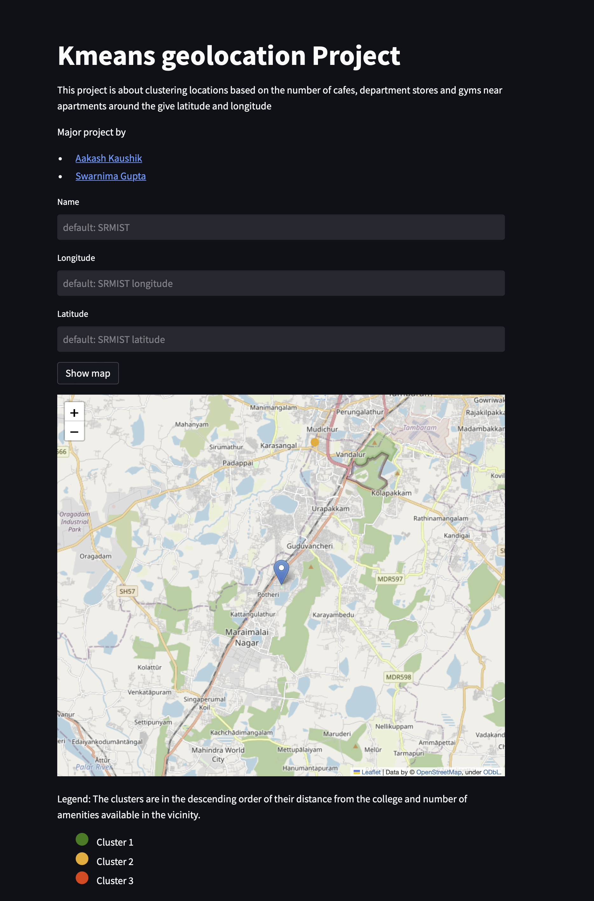

# Exploratory Analysis of Geolocational Data

## Introduction

This project is a geolocation exploratory analysis which takes in the data from here maps API and analyses it to exract and plot apartments based on the vicinity of cafes, department stores and gyms. 

## Usage

1. Clone the repository
``` bash
git clone https://github.com/Aakash-kaushik/geolocation.git

```
2. Install the requirements with pipenv (expected to be already installed)
``` bash
pipenv install
```
3. Run the streamlit app
``` bash
streamlit run app.py
```

## Results




